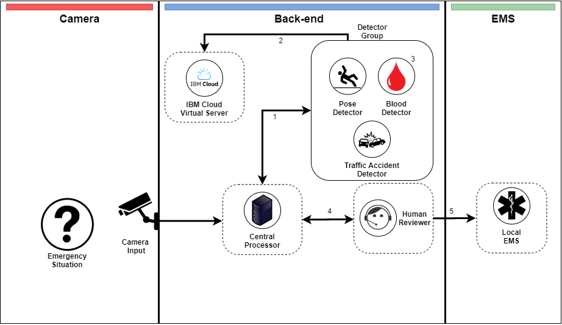

# LocalMinima-Eye_SCDFXIBM

### Local Minima's Team Members
##### Alan Chang
##### Alex Hsia
##### Gary Kim
##### Yong Gi Roh

### Short Description
Our project aims to utilize the public cam and CCTV infrastructure to detect emergency medical situations automatically (e.g. cardiac arrest or car crash) and contact EMS immediately with the location and symptom information. This not only allows SCDF to deliver a more timely response to emergency situations, but also allows them to assist vulnerable cohorts (e.g. elderly with no next to kin) in need.

### Pitch Video Link: 
[Video Link](https://youtube.com)

### The Architecture



### Detailed Description Link: 

### Getting Started

```bash
git clone https://github.com/local-minima/LocalMinima-Eye_SCDFXIBM
cd LocalMinima-Eye_SCDFXIBM
npm install
npm run frontend:dev
```

### IBM Functions

One of the important parts of how our system works involves pose detection. This is done with the [IBM Human Pose Estimator](https://github.com/IBM/MAX-Human-Pose-Estimator) which is running on an IBM Virtual Server.
