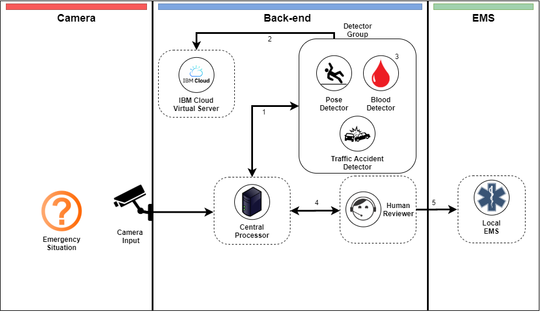

# LocalMinima-Eye_SCDFXIBM

### Local Minima's Team Members

##### Alan Chang

##### Alex Hsia

##### Gary Kim

##### Yong Gi Roh

### Short Description

### Pitch Video Link: 

### The Architecture



### Detailed Description Link: 

### Getting Started

```bash
git clone https://github.com/local-minima/LocalMinima-Eye_SCDFXIBM
cd LocalMinima-Eye_SCDFXIBM
npm install
npm run frontend:dev
```

### IBM Functions

One of the important parts of how our system works involves pose detection. This is done with the [IBM Human Pose Estimator](https://github.com/IBM/MAX-Human-Pose-Estimator) which is running on an IBM Virtual Server.
