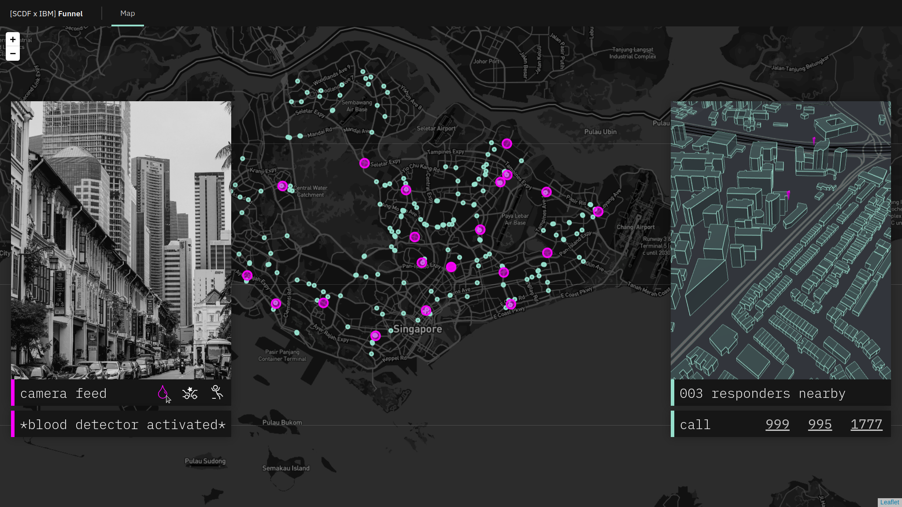
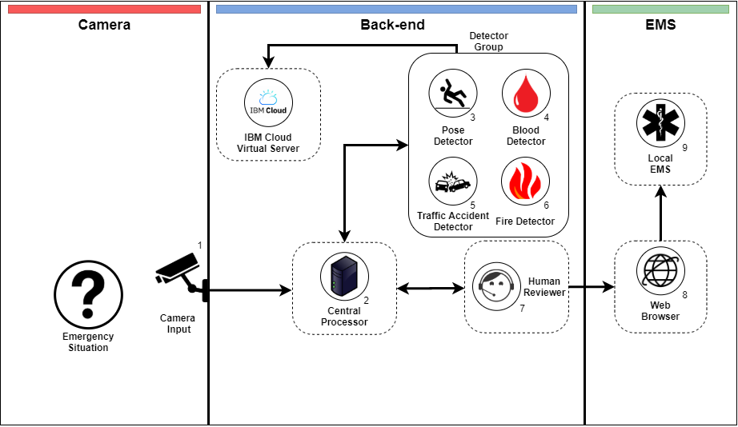

# LocalMinima-Eye_SCDFXIBM



### Local Minima's Team Members
##### Alan Chang
##### Alex Hsia
##### Gary Kim
##### Yong Gi Roh

### Short Description
Our project leverages existing infrastructure (CCTVs) to detect emergency medical situations automatically (e.g. cardiac arrest or car crash). Once the program detects the situation as exceeding a certain risk threshold, a human reviewer is alerted, who can then contact EMS immediately with the location and symptom information. This not only allows SCDF to deliver a more timely response to emergency situations, but also allows them to assist vulnerable cohorts (e.g. elderly with no next to kin) in need.

### Pitch Video Link: 
[Video Link](https://youtube.com)

### The Architecture


1. A camera records a live video that is sent to the central processor.
2. The central processor opens the detector group softwares.
3. IBM Human Pose Estimator detects whether someone is injured or sick based on the pose (e.g. lying down motionless for too long).
4. The blood detector detects blood based on the color.
5. Traffic accident detector uses machine learning to identify traffic accidents.
6. Fire detector detects uses machine learning to look for fire in accident site.
7. The detector information is sent to the central processor and then to human reviewer for confirmation.
8. The human reviewer will contact EMS at the location through the web browser.
9. Local EMS will be dispatched.

### Detailed Description Link: 

### Getting Started

```bash
git clone https://github.com/local-minima/LocalMinima-Eye_SCDFXIBM
cd LocalMinima-Eye_SCDFXIBM
npm install
npm run frontend:dev
```

### IBM Functions

**More info can be found [here](docs/IBM.md).**

Many of the components of this system relies on APIs that are being run on the IBM cloud infrastructure.

The following are API endpoints that are being run on IBM Cloud and are extensively used throughout this system.

* `https://scdfxibm2020.garykim.dev/traffic`
* `https://scdfxibm2020.garykim.dev/pose/model/predict`
* `https://scdfxibm2020.garykim.dev/fire`
* `https://scdfxibm2020.garykim.dev/body`
* `https://scdfxibm2020.garykim.dev/blood`

You can actually use many of these components on their own.
