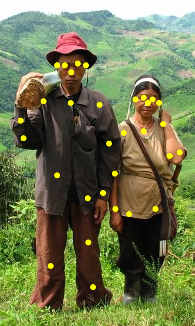

Pose detection is done using an API that provides access to the [IBM Human Pose Estimator](https://github.com/IBM/MAX-Human-Pose-Estimator) which is running on an IBM Virtual Cloud.

Once the pose is dectected, we take the highest point on the body and the lowest point on the body and use those points to determine whether the people in the picture are standing up or lying down.

### Examples

| Image | Lying Down Probabilities |
| :---: | :---: |
|  | `[0.69988343955756]` |
|  | `[0.06711739092108071, 0.08062126433075767]` |

Images from <http://vortexyogahikinginsedona.com/wp-content/uploads/2015/06/Lie-down-grass.jpg> and <https://upload.wikimedia.org/wikipedia/commons/6/68/Akha_cropped_hires.JPG> respectively.
